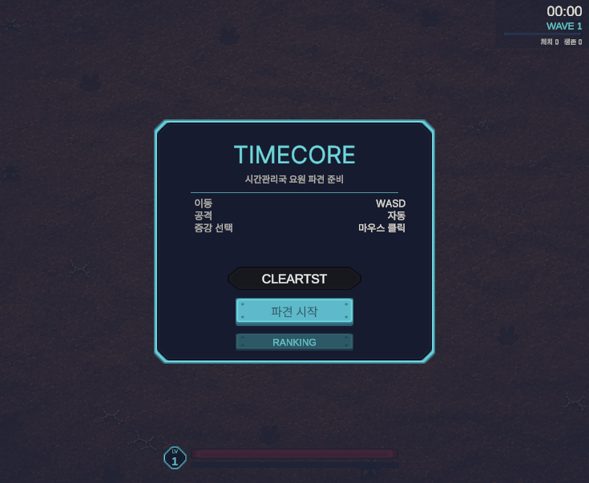
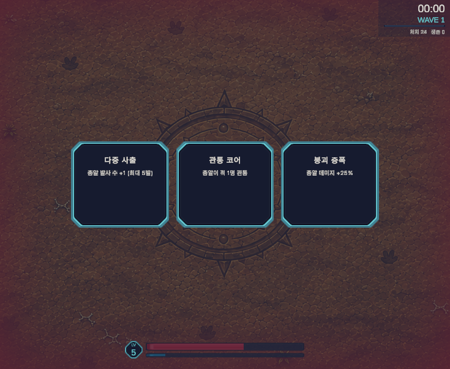

# TimeCore

> 무너진 시간선을 복구하러 **네 개의 시대**를 건너뛰는 브라우저 생존 액션.
> NHN 게임 AI 해커톤 예선 출품작 · Unity 6 / WebGL

## ▶ 지금 바로 플레이

### **https://timecore-chi.vercel.app**

설치도 로그인도 필요 없습니다. 브라우저에서 링크만 열면 바로 시작합니다.
(첫 로딩에 약 33MB를 내려받습니다 — Brotli 압축 기준)

|  |  |
|---|---|
|  |  |

---

## 어떤 게임인가

시간관리국 요원이 되어 **원시 → 중세 → 현대 → 미래** 네 시대를 차례로 지나며
각 시대의 보스를 처치하고 시간선을 복구합니다.

몰려오는 적을 자동으로 쏘며 버티고, 레벨업마다 증강을 골라 빌드를 쌓는
브로테이토·뱀서류 계열입니다. 다만 **시대가 바뀔 때마다 맵·적·보스·필드 기믹이 통째로 갈립니다.**

한 판은 5분 안팎을 목표로 설계했습니다.

## 조작

| 입력 | 동작 |
|---|---|
| `WASD` | 이동 |
| — | 공격은 자동 (가장 가까운 적을 조준) |
| 마우스 클릭 | 레벨업 시 증강 카드 선택 |
| `ESC` | 일시정지 (재개 / 재시작) |

---

## 핵심 시스템

### 시대 4종 — 맵·적·기믹이 전부 다름

| 시대 | 적 성격 | 필드 기믹 | 보스 |
|---|---|---|---|
| 원시 | 야수 떼 — 약하고 많고 빠름 | **지면 균열** — 땅이 지그재그로 갈라짐 | 고대의 포식자 |
| 중세 | 중장 보병 — 느리고 단단함 | **전기 방전** — 아크가 튀며 깜빡임 | 강철의 심문관 |
| 현대 | 기계화 — 물량과 속도 | **십자 폭격** — 끝에서부터 순차 폭발 | 강화 병기 |
| 미래 | 소수 정예 — 가장 단단하고 빠름 | **레이저 격자** — 다중 레이어 광선 | 시간의 지배자 |

압박의 출처를 시대마다 다르게 뒀습니다. 중세는 버티는 싸움, 현대는 쫓기는 싸움입니다.

### 보스 4종 × 패턴 3개 = 12패턴

돌진·낙인·포탑 전개·시간 정지 영역·위상 도약 등, 보스마다 전용 패턴 세트를 가집니다.
보스전 중에도 시대 기믹이 계속 돌아갑니다.

### AI 디렉터 — 판을 읽고 개입한다

5초마다 **처치 속도 ÷ 스폰 속도**(pressure), 체력 비율, 피격 빈도, 적 밀집도를 읽고
네 가지 규칙 중 하나로 판단해 개입합니다.

| 판단 | 개입 |
|---|---|
| 위기 | 회복 코어 배치 |
| 과잉 화력 | 다른 시대 개체 난입 |
| 전선 정체 | 균열 가속 (출현 주기 단축) |
| 전선 고정 | 시간 감속 지대 생성 |

개입할 때마다 화면에 **왜 그랬는지**를 두 줄 배너로 표시합니다. 판단 근거가 보이지 않으면
플레이어에게는 그냥 랜덤이기 때문입니다. 판이 끝나면 콘솔에 판단 로그 전문이 출력됩니다
(샘플: [`docs/DIRECTOR_LOG_SAMPLE.md`](docs/DIRECTOR_LOG_SAMPLE.md)).

### 증강 8종

`시간 가속`(이동속도) · `크로노 오버클럭`(연사) · `붕괴 증폭`(피해) · `시간 왜곡`(경험치 획득 범위)
`균열 복구`(최대 체력) · `관통 코어` · `다중 사출` · `위상 이동`(피격 시 짧은 무적)

### 랭킹 — 로그인 없이 이름만

클리어·사망 기록이 **도달 시대 → 시간** 순으로 정렬됩니다. 클리어는 빠를수록,
사망은 오래 버틸수록 위로 갑니다. 타이틀의 `RANKING` 버튼과 결과 화면에서 볼 수 있습니다.

---

## 기술

| | |
|---|---|
| 엔진 | Unity **6000.3.20f1** / URP 2D |
| 타깃 | WebGL (Brotli 압축) |
| 입력 | Input System 1.19.0 |
| UI | uGUI + TextMeshPro |
| 배포 | Vercel (정적 + 서버리스 함수) |
| 랭킹 저장소 | Upstash Redis (sorted set) |
| 규모 | C# 스크립트 44개 / 약 8,000줄 |

### WebGL 제약이 설계를 바꾼 지점

이 프로젝트에서 내린 결정 상당수는 **"브라우저에서 돌아야 한다"**가 이유입니다.

- **멀티스레딩·`System.IO`·소켓을 못 씁니다.** 저장은 `PlayerPrefs`, 통신은 `UnityWebRequest`만 씁니다.
- **VFX Graph는 compute shader를 요구해 WebGL에서 아예 동작하지 않습니다.** 이펙트는 전부
  스프라이트 기반이고, 상당수는 런타임에 텍스처를 **코드로 굽습니다**(`FxTextures.cs`).
  덕분에 이펙트를 대폭 늘리고도 빌드 용량이 오히려 줄어든 구간이 있습니다.
- **용량 = 로딩 시간**이라 외부 에셋은 팩 전체가 아니라 **필요한 것만** 골라 들여왔습니다
  (Kenney 파티클 80종 중 5종, UI 130종 중 6종. 파티클 팩은 원본 15MB지만 반입분은 그 일부입니다).
- **랭킹 API를 게임과 같은 도메인에 뒀습니다.** WebGL 리더보드가 깨지는 1순위 원인이 CORS인데,
  same-origin이면 아예 발생하지 않습니다.

자세한 판단 과정과 실패·되돌린 결정은 [`docs/AI_LOG.md`](docs/AI_LOG.md)에 전부 기록돼 있습니다.

---

## 저장소 구조

```
Assets/
  Scripts/            게임 로직 44개 (전투·시대·보스·AI 디렉터·UI·랭킹)
  Art/                맵 4종, UI 9-slice 스프라이트
  Resources/FX/       이펙트 스프라이트 (런타임 로드)
  Prefabs/            적·보스·투사체·기믹
  Scenes/SampleScene  단일 씬
deploy/
  api/leaderboard.js  랭킹 API (Vercel 서버리스 함수)
  vercel.json         Brotli 헤더 설정
docs/                 개발 로그·리뷰·라이선스
```

## 빌드 · 배포

```bash
# 빌드: Unity에서 File > Build Settings > WebGL > Build → Build/ 로 출력
# 배포:
deploy.bat            # dist/ 재구성 후 vercel --prod
```

랭킹 API는 Vercel 환경변수 두 개를 요구합니다.

```
UPSTASH_REDIS_REST_URL
UPSTASH_REDIS_REST_TOKEN
```

없어도 게임은 정상 동작하고, 순위표만 `OFFLINE`으로 표시됩니다.

---

## 문서

| 파일 | 내용 |
|---|---|
| [`docs/AI_LOG.md`](docs/AI_LOG.md) | **AI 활용 개발 로그.** 날짜별 작업·프롬프트 원문·설계 판단·검증 수치·실패 기록 |
| [`docs/REVIEW_LOG.md`](docs/REVIEW_LOG.md) | 코드 리뷰 지적사항 추적 (해결/보류/기각) |
| [`docs/FX_ASSETS.md`](docs/FX_ASSETS.md) | 이펙트 에셋 후보 조사와 채택 근거 |
| [`docs/FONT_CHARS.md`](docs/FONT_CHARS.md) | 한글 서브셋 폰트 문자 관리 |
| [`docs/DIRECTOR_LOG_SAMPLE.md`](docs/DIRECTOR_LOG_SAMPLE.md) | AI 디렉터 판단 로그 샘플 |

## 크레딧 · 라이선스

| 항목 | 출처 | 라이선스 |
|---|---|---|
| Pretendard | [orioncactus/pretendard](https://github.com/orioncactus/pretendard) | SIL OFL 1.1 |
| Kenney Particle Pack | [kenney.nl](https://kenney.nl/assets/particle-pack) | CC0 1.0 |
| Kenney UI Pack: Sci-fi | [kenney.nl](https://kenney.nl/assets/ui-pack-sci-fi) | CC0 1.0 |
| LiberationSans | Unity TextMeshPro 번들 | SIL OFL 1.1 |

라이선스 전문은 [`docs/licenses/`](docs/licenses/)에 동봉했습니다.
외부 에셋·오픈소스 전체 목록은 [`docs/AI_LOG.md`](docs/AI_LOG.md) 상단의 출처 표에서 관리합니다.

## 팀

2인 팀입니다.

| 역할 | 담당 |
|---|---|
| 개발 | 전투·시대 전환·보스 패턴·AI 디렉터·UI, 빌드·배포 파이프라인, 랭킹 백엔드 |
| 디자인 | 시대별 맵 아트 4종, 아트 디렉션·컬러 팔레트 |

AI(Claude)와의 협업 방식과 사람이 개입한 지점은 [`docs/AI_LOG.md`](docs/AI_LOG.md) 각 항목의
"AI 산출물 vs 사용자 개입" 줄에 건별로 남겼습니다.
